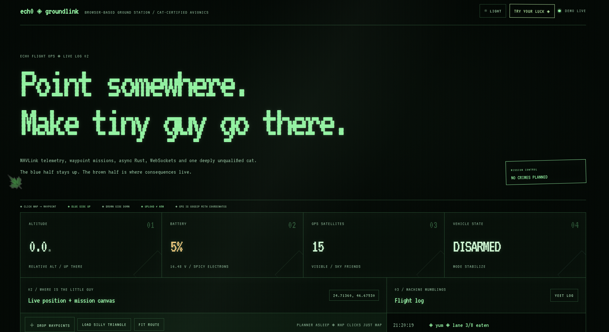
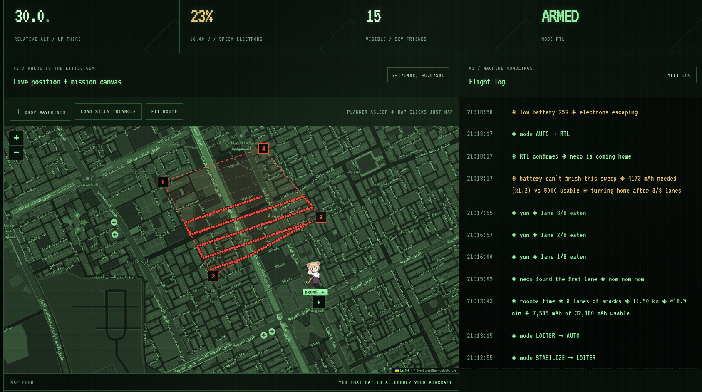
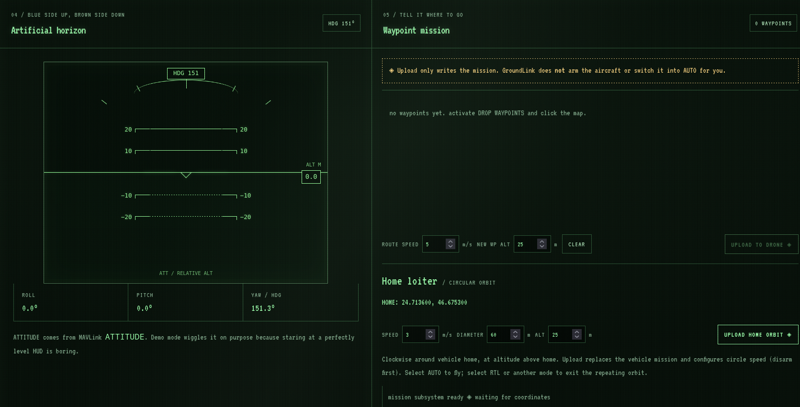

# GroundLink

> **Serious engineering, playful presentation.**

A lightweight web-based ground control station built in **Rust** for communicating with ArduPilot vehicles over **MAVLink**.

Or, in normal-person language:

**Drone sends numbers → Rust does Rust things → pretty dashboard appears.**

GroundLink is still a **work in progress**. Right now I'm building and testing the software with its own native demo mode before moving onto real ArduPilot hardware.

Crashing imaginary drones is considerably cheaper.

---
<h2>Demo</h2>

<p align="center">
  
</p>

<p align="center">
  
</p>

<p align="center">
  
</p>

<p align="center">
  <i>GroundLink running in native demo mode (simulated vehicle and battery). The middle shot is a Sweep run where the demo pack ran low, so it turned home after 3 of 8 lanes. No drone was harmed in the making of these screenshots.</i>
</p>

## What does it do?

GroundLink takes vehicle telemetry and turns it into a simple browser-based ground station.

Currently it handles:

- Live telemetry
- Vehicle position and navigation
- Flight information
- Real-time WebSocket updates
- Waypoint missions with one speed setting for the whole route
- Repeating home orbit with speed, diameter, and altitude controls
- Neco / Den CRT dark theme (the original light theme is still here)
- Built-in simulated vehicle testing

The eventual goal is to connect the same application to a real ArduPilot flight controller through MAVLink.

---

## How does it work?

The backend is written in **Rust**.

For real vehicles, MAVLink messages are handled using `rust-mavlink`. **Axum** handles the web side of the application and WebSockets push live telemetry to the browser.

```text
ArduPilot
    ↓
  MAVLink
    ↓
   Rust
    ↓
   Axum
    ↓
 WebSocket
    ↓
 Browser
```

The frontend is deliberately simple:

- HTML
- CSS
- JavaScript

No React megaproject with 900 dependencies required. 

---

## Wait, where's the drone?

Currently?

**There isn't one.**

GroundLink has a native demo mode written directly into the Rust application.

Running:

```bash
cargo run -- --demo
```

switches GroundLink to its internal simulated telemetry source.

```text
Native Rust Demo
       ↓
   Telemetry
       ↓
Axum + WebSocket
       ↓
    Browser
```

The demo generates changing vehicle telemetry rather than requiring a flight controller just to see if the application works.

It also has separate mission demo behavior, allowing waypoint functionality to be developed without putting a real aircraft in the air.

Basically:

**Fake Drone™ until Real Drone™ is ready.**

---

## Waypoint missions

GroundLink is being built to support basic waypoint missions.

```text
HOME → WP 1 → WP 2 → WP 3 → LAND
```

In demo mode, the simulated vehicle can follow the loaded mission.

With real hardware, GroundLink sends the mission through MAVLink and **ArduPilot handles actually flying the aircraft**.

GroundLink says where to go.

ArduPilot handles the slightly more important problem of getting there without falling out of the sky.

Set **ROUTE SPEED** once (0.5–20 m/s); it applies to every waypoint. The uploaded mission contains home at sequence zero, takeoff to the first waypoint altitude, a ground-speed command, and all your waypoints. ArduCopter holds at the final waypoint; choose RTL yourself when you want to return. Changing a setting locally takes effect on the vehicle after another upload.

### Home loiter / orbit

Set **SPEED**, **DIAMETER**, and **ALT**, then click **UPLOAD HOME ORBIT**. The map previews the circle around the vehicle's reported `HOME_POSITION`; it never substitutes the moving drone position for home. Diameter is 10–500 m in 2 m steps, altitude is 1–500 m above home, and speed is 0.5–20 m/s.

For ArduCopter this is a clockwise circular orbit, using `NAV_LOITER_TURNS` and an indefinite `DO_JUMP` loop. It replaces the loaded vehicle mission. Upload while disarmed, then arm and select **AUTO** using your normal flight controls. Exit the repeating orbit by selecting **RTL** or another flight mode. Uploading does not arm or switch modes.

GroundLink converts orbit speed to angular rate (`speed / radius`, in degrees/second), writes `CIRCLE_RATE`, and checks the vehicle's parameter readback before uploading. That parameter persists for later CIRCLE flights. On upload failure GroundLink attempts to restore its previous value and reports a failed restore. The mission also carries the ground-speed command for newer ArduCopter orbit implementations. Requested speed remains subject to the autopilot's acceleration limits; speed/diameter combinations above 90°/s are rejected. This flight-plan implementation targets **ArduCopter**, not Plane or Rover.

The native demo follows the chosen route speed, holds the last waypoint, and flies home orbits with the selected diameter and speed. It previews flight paths directly rather than modelling takeoff and vehicle dynamics.

### Dark mode: the Den has acquired a flight department

Dark mode now uses Neco's green phosphor palette and bundled VT323 font, scanlines, animated static, phosphor mask, glass reflections, raster breathing, and a subtle rolling/sync band. The dashboard layout, map interaction, and light palette stay as they were. Dark map tiles use monochrome green phosphor grading while markers and controls stay unfiltered. The artificial horizon switches to airline HUD-inspired green symbology on black, with heading and relative-altitude readouts; no flight-path vector is shown because the required velocity data is not available. Pitch ladder spacing uses the same pixels-per-degree calibration as attitude motion. Irregular luminance dips, live low-resolution grain, and occasional sync faults add the Den’s finer CRT details. Effects pause in background tabs and respect reduced-motion settings. The font's license is included in `static/fonts/`.

---

## Sweep (roomba mode)

Part of the main app now, but tucked into a folded drawer under the map so it stays out of the way until you open it. Click **draw**, drop points around the area like waypoints, pick a lane width, and GroundLink lays out back-and-forth lanes (red, and Neco eats them as the drone flies them).

Before launch it asks for battery capacity, remaining percent, average current and a reserve, fills in what it can read (the vehicle's `BATT_CAPACITY` over MAVLink, the demo's simulated pack), and does the maths. Every field can be overridden by hand. The log says `roomba time` when you launch.

During the flight GroundLink watches progress and battery. If the remaining sweep plus the trip home no longer fits in what's left, it switches the vehicle to RTL once. This is a ground-station safety net, not a replacement for the autopilot's own battery failsafe: set `BATT_FS_LOW_ACT` on the vehicle (Sweep reads it and warns, but never writes it).

Honest limits: only tested against the built-in demo vehicle and unit tests. Not tried on real ArduPilot or SITL, and not flown. The estimate is a simple model (average current over estimated time), so treat "tight" as tight. Sorties are not split yet, and there is no resume after a battery swap.

Turn it off entirely with `GROUNDLINK_SWEEP=0`.

# Running GroundLink

## Requirements

You'll need:

- Git
- Rust / Cargo
- A modern browser

That's it for demo mode.

---

## 1. Clone it

```bash
git clone https://github.com/proto6699/GroundLink.git
cd GroundLink
```

## 2. Build it

```bash
cargo build
```

Cargo will download the required Rust dependencies.

## 3. Run the demo

```bash
cargo run -- --demo
```

GroundLink will start using its built-in simulated vehicle.

Open **http://127.0.0.1:3001** and you're good to go. GroundLink no longer shares Neco's port 3000.

To choose another port, run `GROUNDLINK_PORT=3010 cargo run -- --demo` (or omit `--demo` for ArduPilot).

To update an existing checkout, stop its running GroundLink process, run `git pull --ff-only origin main`, then start it again with `cargo run --release -- --demo` or `cargo run --release`.

No drone required.

---

## Normal mode

Running:

```bash
cargo run
```

starts GroundLink in its normal vehicle mode rather than the internal demo.

This is the path intended for MAVLink/ArduPilot communication.

```text
Real Vehicle
     ↓
  ArduPilot
     ↓
   MAVLink
     ↓
 GroundLink
     ↓
   Browser
```

Real flight-controller and telemetry-radio testing is still part of the project's ongoing development.

---

## What's under the hood?

| | |
|---|---|
| Main language | Rust |
| Web backend | Axum |
| Vehicle protocol | MAVLink |
| MAVLink library | rust-mavlink |
| Browser communication | WebSockets |
| Frontend | HTML / CSS / JavaScript |
| Demo vehicle | Native Rust simulation |
| Target autopilot | ArduPilot |
| Build system | Cargo |

---

## How I built it

I built GroundLink in pieces rather than trying to make an entire ground station at once.

First came the telemetry model and vehicle data. Then the Rust backend, MAVLink communication, Axum/WebSockets, the browser dashboard, and finally mission functionality.

The built-in demo grew alongside it so I could test everything without depending on hardware.

```text
Telemetry
    ↓
Rust backend
    ↓
MAVLink support
    ↓
Axum + WebSockets
    ↓
Dashboard
    ↓
Waypoint missions
    ↓
Real hardware
    ↓
hopefully not a crater
```

---

## Current status

GroundLink is a **prototype under active development**.

- [x] Rust backend
- [x] Native demo vehicle
- [x] MAVLink communication
- [x] Telemetry handling
- [x] WebSocket telemetry
- [x] Browser interface
- [x] Basic mission architecture
- [x] Demo mission behavior
- [ ] Finish waypoint workflow
- [x] Mission speed controls
- [x] Home orbit planning
- [x] CRT dark theme and independent HTTP port
- [x] Sweep planner and battery estimate (demo and unit tests only)
- [ ] Sweep on real ArduPilot / SITL
- [ ] Real ArduPilot flight controller testing
- [ ] Telemetry radio testing
- [ ] Actual flight testing

Eventually, this:

```text
Native Demo → GroundLink → Browser
```

becomes this:

```text
Drone
  ↓
ArduPilot
  ↓
MAVLink
  ↓
Telemetry Link
  ↓
GroundLink
  ↓
Browser
```

Same GroundLink.

The fake drone just gets replaced by something significantly more capable of breaking a window.

---

## Why?

I wanted to understand what actually happens between:

> **"go to this waypoint"**

and

> **drone say oke

The goal isn't to replace QGroundControl.

It's to understand and build the chain myself:

```text
Human → UI → Rust → MAVLink → ArduPilot → Drone → physics :(
```

---

### Disclaimer

GroundLink is experimental software, not production flight-control software.

The built-in simulator is for development and demonstration. Real hardware testing comes later.

Don't trust my silly Rust program with your $2,000 drone just yet.

---

<p align="center">
  <b>GroundLink</b><br>
  Serious engineering, playful presentation.
</p>
